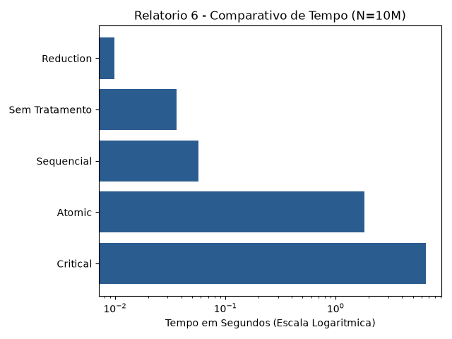

# Relatório 6 - OpenMP Região Crítica

## 1. Enunciado

Implemente diferentes versões de um programa para o cálculo de integrais definidas utilizando o método do trapézio. O programa deve permitir calcular numericamente a integral de uma função $f(x)$ em um intervalo $[a,b]$, utilizando $n$ subdivisões.

Devem ser implementadas as seguintes versões:

* Sequencial
* Paralela sem tratamento para região crítica
* Paralela utilizando critical
* Paralela utilizando atomic
* Paralela utilizando reduction

Após a implementação, compare os resultados obtidos e os tempos médios de execução de cada versão à medida que o número de subdivisões ($n$) aumenta, utilizando gráficos/tabelas, para apresentar e analisar os resultados.

Para cada experimento, discuta:

1. A corretude dos resultados obtidos;
2. As diferenças entre os resultados das versões sequencial e paralelas;
3. O impacto da ausência de sincronização sobre o resultado;
4. As diferenças de desempenho entre as abordagens utilizando critical, atomic e reduction;
5. Como o aumento do número de subdivisões ($n$) influencia o tempo de execução e o desempenho das diferentes versões.

Ao final, explique e justifique as diferenças observadas nos resultados e nos tempos de execução de cada implementação.

## 2. Objetivo da Tarefa

O objetivo desta atividade é comparar exaustivamente os mecanismos de sincronização e controle de região crítica disponibilizados pela biblioteca **OpenMP** (`critical`, `atomic` e `reduction`) na resolução de um problema numérico (Método do Trapézio). A tarefa busca analisar o impacto de cada abordagem tanto na **corretude matemática** (prevenção de condições de corrida) quanto no **desempenho** (medindo a sobrecarga/overhead introduzida na CPU).

## 3. Metodologia

A solução foi implementada na linguagem C e estrutura 5 abordagens para calcular a integral de $f(x) = x^2$ no intervalo de $a = 0.0$ a $b = 10.0$:

1. **Sequencial:** Laço tradicional sem OpenMP (linha de base).
2. **Sem Tratamento:** Paralelização ingênua (`#pragma omp parallel for`) sem proteção, gerando condição de corrida.
3. **Com Critical (`#pragma omp critical`):** Garante exclusão mútua por software, forçando uma única thread por vez na seção crítica.
4. **Com Atomic (`#pragma omp atomic`):** Utiliza instruções de montador atómicas de hardware para atualizar a variável acumuladora.
5. **Com Reduction (`reduction(+:soma)`):** Cada thread mantém um acumulador local privado e realiza a fusão final de forma eficiente.

A medição do tempo foi realizada com a função `omp_get_wtime()`. O programa executa uma bateria de testes automática para três tamanhos de subdivisões ($n = 1.000.000$, $5.000.000$ e $10.000.000$).

## 4. Código-Fonte

```c
#include <stdio.h>
#include <math.h>
#include <omp.h>

// compilar: clang -Xpreprocessor -fopenmp -I$(brew --prefix libomp)/include -L$(brew --prefix libomp)/lib -lomp tarefa6.c -o tarefa6

// Função f(x) = x^2
double f(double x) {
    return x * x;
}

int main() {
    double a = 0.0;
    double b = 10.0;
    // Baterias de testes com diferentes valores de N
    int testes_n[] = {1000000, 5000000, 10000000}; 
    
    for (int t = 0; t < 3; t++) {
        int n = testes_n[t];
        double h = (b - a) / n;
        double extremos = (f(a) + f(b)) / 2.0;
        double soma, integral;
        double inicio, fim;

        printf("=== TESTE COM n = %d ===\n", n);

        // 1. SEQUENCIAL
        soma = 0.0;
        inicio = omp_get_wtime();
        for (int i = 1; i < n; i++) {
            soma += f(a + i * h);
        }
        integral = h * (extremos + soma);
        fim = omp_get_wtime();
        printf("1. Sequencial      | Res: %f | Tempo: %f s\n", integral, fim - inicio);

        // 2. PARALELA (SEM TRATAMENTO - ERRO)
        soma = 0.0;
        inicio = omp_get_wtime();
        #pragma omp parallel for
        for (int i = 1; i < n; i++) {
            soma += f(a + i * h); // Condição de corrida!
        }
        integral = h * (extremos + soma);
        fim = omp_get_wtime();
        printf("2. Sem Tratamento  | Res: %f | Tempo: %f s\n", integral, fim - inicio);

        // 3. PARALELA COM CRITICAL
        soma = 0.0;
        inicio = omp_get_wtime();
        #pragma omp parallel for
        for (int i = 1; i < n; i++) {
            double val = f(a + i * h);
            #pragma omp critical
            {
                soma += val;
            }
        }
        integral = h * (extremos + soma);
        fim = omp_get_wtime();
        printf("3. Com Critical    | Res: %f | Tempo: %f s\n", integral, fim - inicio);

        // 4. PARALELA COM ATOMIC
        soma = 0.0;
        inicio = omp_get_wtime();
        #pragma omp parallel for
        for (int i = 1; i < n; i++) {
            double val = f(a + i * h);
            #pragma omp atomic
            soma += val;
        }
        integral = h * (extremos + soma);
        fim = omp_get_wtime();
        printf("4. Com Atomic      | Res: %f | Tempo: %f s\n", integral, fim - inicio);

        // 5. PARALELA COM REDUCTION
        soma = 0.0;
        inicio = omp_get_wtime();
        #pragma omp parallel for reduction(+:soma)
        for (int i = 1; i < n; i++) {
            soma += f(a + i * h);
        }
        integral = h * (extremos + soma);
        fim = omp_get_wtime();
        printf("5. Com Reduction   | Res: %f | Tempo: %f s\n\n", integral, fim - inicio);
    }

    return 0;
}
```

## 5. Resultados e Análises

### 5.1. Tabela Comparativa de Resultados e Tempos de Execução (Dados Reais)

| Versão | Corretude | Tempo ($n = 1.000.000$) | Tempo ($n = 5.000.000$) | Tempo ($n = 10.000.000$) |
| :--- | :--- | :--- | :--- | :--- |
| **1. Sequencial** | **Correto** ($333,333333$) | 0,005739 s | 0,028658 s | 0,057081 s |
| **2. Sem Tratamento** | **Incorreto** ($105,25$ / $51,84$ / $53,90$) | 0,004363 s | 0,016705 s | 0,036033 s |
| **3. Com Critical** | **Correto** ($333,333333$) | 1,307243 s | 3,786522 s | 6,557846 s |
| **4. Com Atomic** | **Correto** ($333,333333$) | 0,206535 s | 0,904978 s | 1,809059 s |
| **5. Com Reduction** | **Correto** ($333,333333$) | **0,001025 s** | **0,004907 s** | **0,009932 s** |

### 5.2. Representação Gráfica dos Resultados



### 5.3. Discussão dos Experimentos com os Dados Reais

#### 1 e 2. Corretude dos Resultados e Ausência de Sincronização
* As versões **Sequencial**, **Critical**, **Atomic** e **Reduction** obtiveram o resultado matematicamente exato da integral ($\int_{0}^{10} x^2 \, dx = 333,333333$).
* A versão **Sem Tratamento** resultou em valores completamente incorretos. A ausência de proteção no comando `soma += f(...)` gerou uma **Condição de Corrida (Race Condition)** crítica, fazendo com que milhares de atualizações de memória fossem sobrepostas e perdidas no hardware.

#### 3. Comparativo de Desempenho entre Critical, Atomic e Reduction
* **`critical` (O mais lento):** A instrução `#pragma omp critical` cria um *lock* por software a cada iteração do laço. Para $n = 10.000.000$, o tempo disparou para **6,557846 s** — ficando **mais de 114 vezes mais lento do que o código sequencial** devido à **Contenção de Trava (*Lock Contention*)**.
* **`atomic` (Melhoria de Hardware):** A instrução `#pragma omp atomic` reduziu o tempo para $n = 10M$ de $6,55\text{ s}$ para **1,809059 s** (uma melhoria de ~3,6x em relação ao `critical`). Por utilizar instruções de montador nativas da CPU, elimina o *overhead* de software, mas continua limitado pelo gargalo de centenas de milhares de threads disputando a mesma posição de memória RAM.
* **`reduction` (A Solução Ideal):** A cláusula `reduction(+:soma)` apresentou o menor tempo em todas as baterias. Para $n = 10.000.000$, o tempo caiu de $0,057081\text{ s}$ (sequencial) para **0,009932 s**, alcançando um **Speedup real de ~5,75x**. Como cada thread acumula os dados em um registrador/Cache privado, a contenção de memória foi completamente eliminada.

#### 4. Impacto do Aumento de Subdivisões ($n$)
À medida que $n$ cresce de $1M$ para $10M$:
* Nas versões com `critical` e `atomic`, a sobrecarga de sincronização escala linearmente com o número de iterações.
* Na versão com `reduction`, o aumento das iterações é absorvido com alta eficiência por todos os núcleos da CPU, mantendo a aceleração constante.

#### 4. Impacto do Aumento de Subdivisões ($n$)
À medida que $n$ cresce de $1M$ para $10M$:

* Nas versões com `critical` e `atomic`, a sobrecarga de sincronização escala linearmente com o número de iterações, gerando um custo proibitivo para matrizes/vetores grandes.
* Na versão com `reduction`, o aumento das iterações é absorvido com alta eficiência por todos os núcleos da CPU, mantendo a aceleração constante.

## 6. Conclusão

A atividade comprova na prática que a escolha do mecanismo de sincronização no OpenMP é determinante para o sucesso da paralelização. O uso de travas manuais por iteração via `#pragma omp critical` cria um gargalo severo que torna o programa muito mais lento que a sua versão sequencial. O uso de instruções atômicas (`atomic`) mitiga esse efeito, mas ainda sofre com a saturação do barramento de memória. Por fim, a técnica de **redução (`reduction`)** provou ser a abordagem correta para acumulações em laços paralelos, pois garante total precisão matemática eliminando a disputa por memória e entregando um ganho de velocidade real e expressivo.