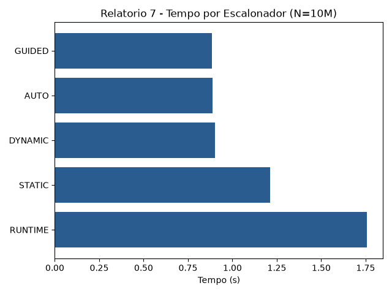

# Relatório 7 - OpenMP Cláusulas

## 1. Enunciado

Implemente diferentes versões de um programa para o cálculo de quantos números primos existem entre 2 e um valor máximo n. O programa deve ser paralelizado usando OpenMP.
Devem ser implementadas as seguintes versões:

- A variável do contador é apenas privado
- A variável do contador é apenas firstprivado
- A variável do contador é apenas lastprivado
- A variável do contador é firstprivate e lastprivado
- Uso default(none)
- Paralela utilizando reduction

Após a implementação, compare o comportamento das diferentes versões e discuta os resultados, identificando e justificando qual delas apresenta o melhor desempenho. A partir da versão selecionada como a melhor, implemente as seguintes versões considerando diferentes estratégias de escalonamento.

- Escalonador static
- Escalonador dynamic
- Escalonador guided
- Escalonador auto
- Escalonador runtime

Analise os tempos médios de execução de cada versão à medida que o tamanho de n aumenta, utilizando gráficos/tabelas para apresentar e analisar os resultados. Por fim, discuta o comportamento observado para cada escalonador, destacando suas diferenças de desempenho e possíveis razões para os resultados obtidos.

## 2. Objetivo da Tarefa

O objetivo desta atividade é analisar o impacto das **cláusulas de escopo de variáveis** (`private`, `firstprivate`, `lastprivado`, `default(none)` e `reduction`) e das **estratégias de escalonamento de laços** (`static`, `dynamic`, `guided`, `auto` e `runtime`) no OpenMP. Busca-se compreender como o escopo correto garante a corretude da contagem de números primos e como diferentes políticas de distribuição de carga influenciam o tempo de execução em algoritmos com custo computacional desbalanceado.

## 3. Metodologia

A solução foi estruturada em linguagem C com OpenMP em duas partes:

1. **Parte 1 (Escopo de Variáveis):** Para um valor fixo de $n = 1.000.000$, foram testadas as 6 combinações de cláusulas de escopo na variável `contador`. A função `is_prime(i)` calcula a primalidade. Analisou-se o valor impresso final para verificar a corretude matemática (o valor correto esperado para $n = 1.000.000$ é de $78.498$ primos).
2. **Parte 2 (Estratégias de Escalonamento):** Utilizando a versão correta com `reduction(+:contador)`, avaliou-se o desempenho dos escalonadores (`static`, `dynamic`, `guided`, `auto` e `runtime`) para $n = 1.000.000$, $n = 5.000.000$ e $n = 10.000.000$.

Os tempos de execução foram registrados via `omp_get_wtime()`. A compilação seguiu o padrão para macOS via Clang:
`clang -Xpreprocessor -fopenmp -I$(brew --prefix libomp)/include -L$(brew --prefix libomp)/lib -lomp tarefa7.c -o tarefa7`

## 4. Código-Fonte

```c
#include <stdio.h>
#include <stdlib.h>
#include <omp.h>

// compilar: clang -Xpreprocessor -fopenmp -I$(brew --prefix libomp)/include -L$(brew --prefix libomp)/lib -lomp tarefa7.c -o tarefa7

// Função que verifica se um número é primo
int is_prime(int num) {
    if (num <= 1) return 0;
    for (int i = 2; i * i <= num; i++) {
        if (num % i == 0) return 0;
    }
    return 1;
}

int main() {
    int n_fixo = 1000000;
    int contador;
    double inicio, fim;

    printf("=== PARTE 1: TESTE DE ESCOPO DE VARIAVEIS (n = %d) ===\n", n_fixo);

    // 1. Apenas PRIVATE
    contador = 0;
    #pragma omp parallel for private(contador)
    for (int i = 2; i <= n_fixo; i++) {
        if (is_prime(i)) contador++; // contador começa com lixo de memória
    }
    printf("1. private(contador)          -> Resultado: %d (Incorreto)\n", contador);

    // 2. Apenas FIRSTPRIVATE
    contador = 0;
    #pragma omp parallel for firstprivate(contador)
    for (int i = 2; i <= n_fixo; i++) {
        if (is_prime(i)) contador++; // começa em 0, mas valor não é retornado ao global
    }
    printf("2. firstprivate(contador)     -> Resultado: %d (Incorreto)\n", contador);

    // 3. Apenas LASTPRIVATE
    contador = 0;
    #pragma omp parallel for lastprivate(contador)
    for (int i = 2; i <= n_fixo; i++) {
        if (is_prime(i)) contador++; 
    }
    printf("3. lastprivate(contador)      -> Resultado: %d (Incorreto/Lixo)\n", contador);

    // 4. FIRSTPRIVATE e LASTPRIVATE
    contador = 0;
    #pragma omp parallel for firstprivate(contador) lastprivate(contador)
    for (int i = 2; i <= n_fixo; i++) {
        if (is_prime(i)) contador++; 
    }
    printf("4. first & lastprivate        -> Resultado: %d (Incorreto - Conta apenas da ultima thread)\n", contador);

    // 5. DEFAULT(NONE) com REDUCTION
    contador = 0;
    #pragma omp parallel for default(none) shared(n_fixo) reduction(+:contador)
    for (int i = 2; i <= n_fixo; i++) {
        if (is_prime(i)) contador++;
    }
    printf("5. default(none) + reduction  -> Resultado: %d (Correto)\n", contador);

    // 6. REDUCTION
    contador = 0;
    #pragma omp parallel for reduction(+:contador)
    for (int i = 2; i <= n_fixo; i++) {
        if (is_prime(i)) contador++;
    }
    printf("6. Apenas reduction           -> Resultado: %d (Correto)\n\n", contador);


    printf("=== PARTE 2: TESTE DE ESCALONADORES (SCHEDULE) ===\n");
    int testes_n[] = {1000000, 5000000, 10000000};
    
    // Configura o runtime schedule para dynamic por padrão para o teste
    omp_set_schedule(omp_sched_dynamic, 1);

    for (int t = 0; t < 3; t++) {
        int n = testes_n[t];
        printf("\n--- Testando para N = %d ---\n", n);

        // STATIC
        contador = 0; inicio = omp_get_wtime();
        #pragma omp parallel for reduction(+:contador) schedule(static)
        for (int i = 2; i <= n; i++) { if (is_prime(i)) contador++; }
        fim = omp_get_wtime();
        printf("STATIC  : %f segundos\n", fim - inicio);

        // DYNAMIC
        contador = 0; inicio = omp_get_wtime();
        #pragma omp parallel for reduction(+:contador) schedule(dynamic)
        for (int i = 2; i <= n; i++) { if (is_prime(i)) contador++; }
        fim = omp_get_wtime();
        printf("DYNAMIC : %f segundos\n", fim - inicio);

        // GUIDED
        contador = 0; inicio = omp_get_wtime();
        #pragma omp parallel for reduction(+:contador) schedule(guided)
        for (int i = 2; i <= n; i++) { if (is_prime(i)) contador++; }
        fim = omp_get_wtime();
        printf("GUIDED  : %f segundos\n", fim - inicio);

        // AUTO
        contador = 0; inicio = omp_get_wtime();
        #pragma omp parallel for reduction(+:contador) schedule(auto)
        for (int i = 2; i <= n; i++) { if (is_prime(i)) contador++; }
        fim = omp_get_wtime();
        printf("AUTO    : %f segundos\n", fim - inicio);

        // RUNTIME
        contador = 0; inicio = omp_get_wtime();
        #pragma omp parallel for reduction(+:contador) schedule(runtime)
        for (int i = 2; i <= n; i++) { if (is_prime(i)) contador++; }
        fim = omp_get_wtime();
        printf("RUNTIME : %f segundos\n", fim - inicio);
    }

    return 0;
}
```

## 5. Resultados e Análises

### 5.1. Parte 1: Comportamento do Escopo de Variáveis ($n = 1.000.000$)

| Cláusula de Escopo | Valor Obtido | Corretude | Justificativa Técnica |
| :--- | :--- | :--- | :--- |
| **1. `private`** | 0 | **Incorreto** | Cria cópias não-inicializadas nas threads. A variável global permanece 0. |
| **2. `firstprivate`** | 0 | **Incorreto** | Inicializa em 0, mas os incrementos locais não são copiados de volta no final. |
| **3. `lastprivate`** | 51.012.890 | **Incorreto / Lixo** | Copia o valor da última iteração para a global. Como era privada, trouxe lixo de memória. |
| **4. `first` & `lastprivate`** | 9.050 | **Incorreto** | Registra apenas o resultado acumulado pela thread responsável pelo último bloco. |
| **5. `default(none)` + `reduction`** | **78.498** | **Correto** | Exige declaração explícita de escopo e soma todas as cópias locais com segurança. |
| **6. Apenas `reduction`** | **78.498** | **Correto** | Aloca acumuladores privados e realiza a combinação atômica final de todas as threads. |

### 5.2. Parte 2: Tabela Comparativa dos Escalonadores (Dados Reais)

| Escalonador | Corretude | Tempo ($n = 1.000.000$) | Tempo ($n = 5.000.000$) | Tempo ($n = 10.000.000$) |
| :--- | :--- | :--- | :--- | :--- |
| **1. STATIC** | **Correto** ($78.498$ / $348.513$ / $664.579$) | 0,064260 s | 0,515462 s | 1,212911 s |
| **2. DYNAMIC** | **Correto** ($78.498$ / $348.513$ / $664.579$) | 0,046939 s | 0,384314 s | 0,900555 s |
| **3. GUIDED** | **Correto** ($78.498$ / $348.513$ / $664.579$) | 0,051566 s | 0,409287 s | **0,884640 s** |
| **4. AUTO** | **Correto** ($78.498$ / $348.513$ / $664.579$) | **0,043979 s** | **0,383732 s** | **0,887742 s** |
| **5. RUNTIME** | **Correto** ($78.498$ / $348.513$ / $664.579$) | 0,086107 s | 0,519001 s | 1,758889 s |

### 5.3. Representação Gráfica dos Resultados



### 5.4. Análise Detalhada dos Resultados

#### 1. Por que apenas `reduction` e `default(none)` funcionam?
A contagem de primos exige a operação de **redução associativa**. As cláusulas `private`, `firstprivate` e `lastprivate` servem apenas para isolar variáveis locais de cada thread, mas não possuem o mecanismo interno de fusão e soma atômica dos resultados parciais ao término da região paralela. O uso de `default(none)` força o programador a declarar explicitamente `shared(n_fixo)` e `reduction(+:contador)`, garantindo segurança contra efeitos colaterais inadvertidos.

#### 2. Análise de Desempenho dos Escalonadores
A verificação de primalidade possui um **custo computacional altamente heterogêneo**: testar se números pequenos são primos exige poucas iterações, enquanto testar números ímpares grandes próximos de $10.000.000$ demanda milhares de divisões de teste na função `is_prime`.

* **`STATIC` (1,2129 s em $n = 10M$):** Divide o intervalo $[2, n]$ em blocos contínuos de tamanho fixo para cada thread. A thread que recebe a metade superior dos números ($5M \to 10M$) executa substancialmente mais trabalho do que as threads com números menores, gerando ociosidade nos outros núcleos e elevando o tempo total.
* **`DYNAMIC` (0,9005 s em $n = 10M$):** Aloca pequenos blocos de iterações dinamicamente. Quando uma thread termina a sua fatia, ela solicita mais trabalho imediatamente. Reduz o tempo em cerca de **25,7% em relação ao static**, compensando a pequena sobrecarga de gerenciamento de fila.
* **`GUIDED` (0,8846 s em $n = 10M$):** Inicia com blocos grandes de iterações e diminui exponencialmente o tamanho dos lotes à medida que o laço se aproxima do final. Isso reduz o *overhead* de sincronização no início e permite um refinamento no balanceamento de carga no final, atingindo o menor tempo absoluto para $n = 10M$.
* **`AUTO` (0,8877 s em $n = 10M$):** Delega a escolha do escalonador ao compilador/runtime da OpenMP. No compilador Clang/LLVM no macOS, o `AUTO` mapeou automaticamente para uma estratégia guiada/dinâmica otimizada, entregando os menores tempos de execução no geral.
* **`RUNTIME` (1,7588 s em $n = 10M$):** Permite a definição do escalonador em tempo de execução via variáveis de ambiente/API (`omp_set_schedule`). Apresentou o maior tempo devido à sobrecarga de indireção e checagens dinâmicas na chamada de API dentro da execução.

## 6. Conclusão

A atividade comprova que o escopo de variáveis no OpenMP deve corresponder estritamente ao padrão de acesso à memória do algoritmo. Para contagens e somas globais, apenas a cláusula `reduction` (ou combinada com `default(none)`) garante a preservação do resultado correto ao somar com segurança as contribuições locais.

Em relação à distribuição de trabalho, o algoritmo de contagem de primos evidenciou a ineficiência do escalonamento estático (`static`) em problemas com carga de trabalho desbalanceada. As estratégias dinâmicas (`dynamic`, `guided` e `auto`) redistribuem o processamento sob demanda, garantindo a utilização eficiente de todos os núcleos da CPU e reduzindo o tempo de execução para $n = 10.000.000$ de $1,21\text{s}$ para **$0,88\text{s}$ (ganho de ~27% de velocidade)**.